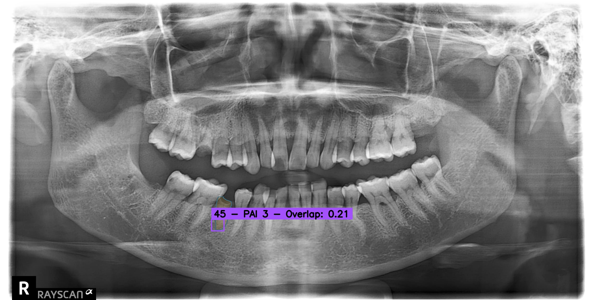
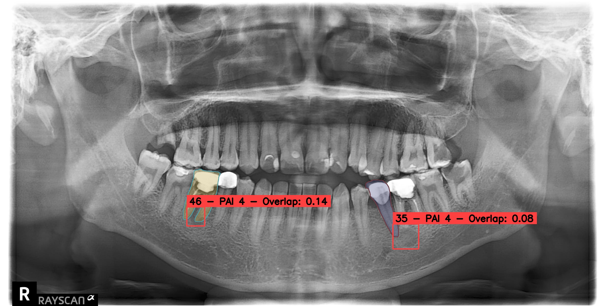

# YoLeTooth: Framework for Tooth Segmentation and Periapical Lesion Detection on OPTs 🦷
<p align="center">
  
&nbsp; &nbsp; &nbsp; &nbsp;
  
</p>

YoLeTooth is a comprehensive deep learning toolkit for dental image analysis, providing tools for detection and segmentation of dental structures and periapical lesions, via Periapical Index (PAI), in radiographic images. The suite includes state-of-the-art models for object detection and segmentation tasks, such as RF-DETR and YOLO.

## ✨ Features
- 📊 **Multi-dataset support**: Works with Periapical, DENTEX, and custom dual-labeled datasets
- 🔍 **Advanced detection models**: Implementation of RF-DETR and YOLO detection pipelines
- 🧩 **Segmentation capabilities**: Teeth segmentation with YOLO-based models
- 🔄 **Data conversion**: Tools to transform between different annotation formats
- 🖼️ **Image enhancement**: Advanced preprocessing tools for dental radiographs
- 📈 **Experiment tracking**: Integration with Weights & Biases for experiment management
- 🔬 **Visualization tools**: Advanced visualization for segmentation masks and detection results

## 🛠️ Installation

### Prerequisites
First, install [PyTorch](https://pytorch.org/get-started/locally/) with the appropriate CUDA version:

```bash
pip install torch torchvision torchaudio
```

_PyTorch v2.4.1 is recommended for proper [FlashAttention](https://github.com/Dao-AILab/flash-attention/releases) support_:
```bash
pip install torch==2.4.1 torchvision==0.19.1 torchaudio==2.4.1 --index-url https://download.pytorch.org/whl/cu121
```

Then install the required dependencies based on your environment (Linux or Windows):

```bash
pip install -r podman/requirements_*.txt
```

## 📂 Project Structure
- **datasets**: Dataset handlers for different dental image collections
  - `dentex.py`: Handler for DENTEX dataset
  - `dual_label.py`: Handler for DualLabel dataset
  - `periapical.py`: Handler for Periapical Lesion dataset
  - `teeth_seg.py`: Handler for Teeth Segmentation dataset

- **rf_detr**: Implementation of RF-DETR model for dental object detection
  - `inference.py`: Inference script for RF-DETR
  - `train.py`: Training script for RF-DETR models

- **yolo_det**: YOLO-based detection pipeline
  - `detection_example.py`: Example script for YOLO detection
  - `inference.py`: Inference script for YOLO detection
  <!-- - `relog_logs.py`: Script to re-log WanB logs for YOLO Detection models -->
  - `train.py`: Training script for YOLO detection models

- **yolo_seg**: YOLO-based segmentation pipeline
  - `inference.py`: Inference script for YOLO segmentation
  <!-- - `relog_logs.py`: Script to re-log WanB logs for YOLO Segmentation models -->
  - `segmentation_example.py`: Example script for YOLO segmentation
  - `train.py`: Training script for segmentation models
  - `val.py`: Validation script for segmentation models

- **pipeline**: End-to-end pipelines combining detection and segmentation
  - `seg_det.py`: Combined segmentation and detection pipeline

- **misc**: Utility functions and helper scripts
  - `augmentations.py`: Image enhancement and data augmentation
  - `dataset_builder.py`: Dataset builder for custom datasets
  - `scheduler.py`: Warmup scheduler for training
  - `utils.py`: General utility functions

## 🚀 Usage

### Training Detection Models

#### RF-DETR
```bash
python rf_detr/train.py
```

#### YOLO Detection
```bash
python yolo_det/train.py
```

### Training Segmentation Models
```bash
python yolo_seg/train.py
```

### Running the Combined Pipeline
The pipeline combines segmentation and detection results, showing PAI (Periapical Index) values overlaid on segmented teeth:

```bash
python pipeline/seg_det.py
```

## ⚙️ Configuration
The project uses configuration dictionaries in each module to control behavior. Key configuration options include:

### Dataset Configuration
```python
dataset_configs = {
    'name': 'Periapical',  # Dataset name ('Periapical', 'DENTEX', etc.)
    'task_type': 'detection',
    'path': 'path/to/dataset',  
    'create_yolo_version': False,  # Convert to YOLO format (for YOLO training)
    'create_rf_detr_version': True,  # Convert to RF-DETR format (for RF-DETR training)
    'enhance_images': False,  # Apply image enhancement
}
```

### Model Configuration
Common model configurations are listed in a dictionary, with specific parameters for YOLO and RF-DETR models.

#### Common Parameters (Both YOLO & RF-DETR)
```python
    'device': 'cuda:0',           # GPU device to use
    'imgsz': 1280,                # Input image size
    'epochs': 250,                # Number of training epochs
    'weight_decay': 1e-4,         # Weight decay for regularization
    'warmup_epochs': 0,           # Number of warmup epochs
    'resume': False,              # Resume training from checkpoint
```

##### YOLO-Specific Parameters

```python
model_configs = {
    'yolo_version': 8,            # YOLO version [8, 9, 10, 11, 12]
    'model_version': 'm',         # Model size [n, s, m, l, x, t, c, e, b]
    'cache': True,                # Cache images for faster training
    'batch': 16,                  # Batch size
    'optimizer': 'adamw',         # Optimizer [SGD, Adam, AdamW, RMSProp, auto]
    'lr0': 1e-2,                  # Initial learning rate
    'lrf': 1e-2,                  # Final learning rate
    'cos_lr': False,              # Cosine learning rate scheduler
    'close_mosaic': 10,           # Epochs to close mosaic augmentation
    'momentum': 0.937,            # SGD momentum
    'patience': 20,               # Early stopping patience
    'dropout': 0.0,               # Dropout rate (0.0 = no dropout)
    
    # Augmentation parameters
    'hsv_h': 0.0,                 # HSV-Hue augmentation
    'hsv_s': 0.0,                 # HSV-Saturation augmentation
    'hsv_v': 0.0,                 # HSV-Value augmentation
    'degrees': 0.0,               # Image rotation degrees
    'fliplr': 0.0,                # Horizontal flip probability
}
```

##### RF-DETR-Specific Parameters
```python
model_configs = {
    'model_path': 'RFDETR',             # Model architecture identifier
    'model_version': 'base',            # Model size ['base', 'large']
    'batch_size': 4,                    # Batch size
    'grad_accum_steps': 4,              # Gradient accumulation steps
    'lr': 1e-4,                         # Main learning rate
    'lr_encoder': 1e-5,                 # Encoder learning rate
    'use_ema': True,                    # Exponential Moving Average
    'gradient_checkpointing': True,     # Memory optimization
    'checkpoint_interval': 5,           # Save checkpoint every N epochs
    'early_stopping': True,             # Enable early stopping
    'early_stopping_patience': 10,      # Early stopping patience
    'early_stopping_min_delta': 0.001,  # Minimum improvement threshold
    'early_stopping_use_ema': True,     # Use EMA for early stopping
}
```

##### Important Notes
If you select <i>YOLOv12</i> as object detector or segmentation model, ensure you install the proper ```ultralytics``` package version from the ```yolov12``` directory:
```bash
cd yolov12 && pip install -e .
```

<!-- Also, if and only if you would like to retrieve Mean Dice Score (<i>mDice</i>) and Mean IoU (<i>mIoU</i>) during validition of the segmentation models, make sure to install the proper ```ultralytics``` package from the same directory:
```bash
cd yolov12 && git checkout -b dice_miou && pip install -e .
``` -->

<!-- ## 📝 Citation
If you use this toolkit in your research, please cite:

```
@article{article_name,
  title={},
  author={},
  journal={},
  year={2025}
}
``` -->

## 📄 License
This project is licensed under the MIT License.

## 👥🙏 Contributing and Acknowledgements
Contributions are welcome! Please feel free to submit a Pull Request.

Special thanks to the following libraries and frameworks that made this project possible:
- [YOLO](https://github.com/ultralytics/yolov5) for object detection
- [RF-DETR](https://github.com/IDEA-Research/RF-DETR) for transformer-based detection
- [Supervision](https://github.com/roboflow/supervision) for visualization utilities

---

🔗 **GitHub Repository**: [https://github.com/SlimShadys/YoLeTooth](https://github.com/SlimShadys/YoLeTooth)  
📧 **Contact**: scarano.2047315@studenti.uniroma1.it
